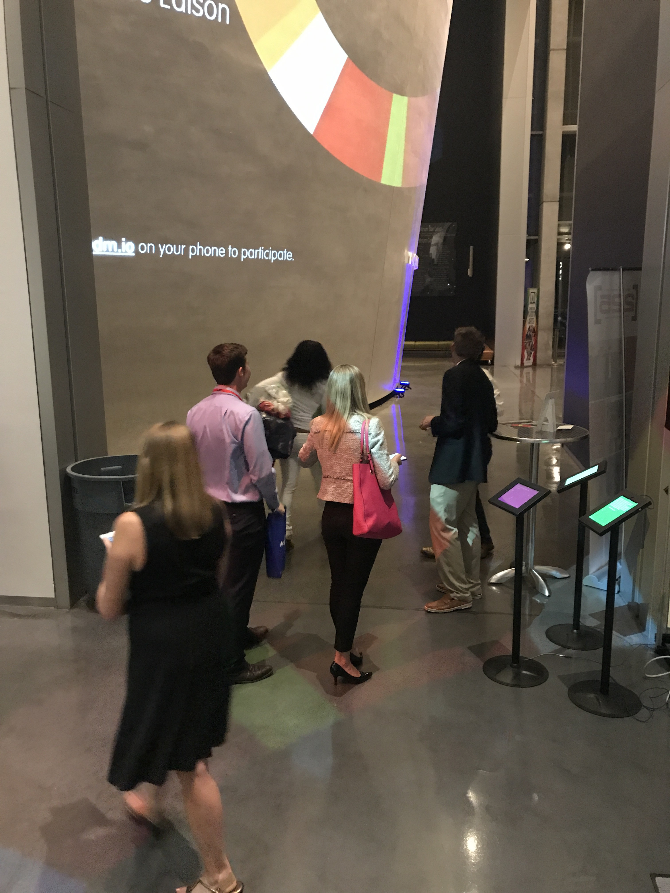
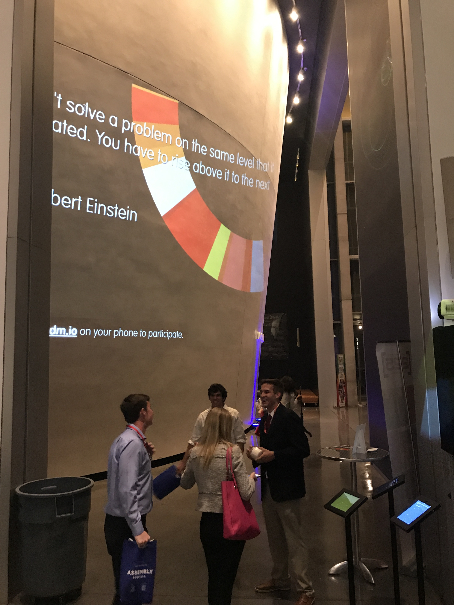
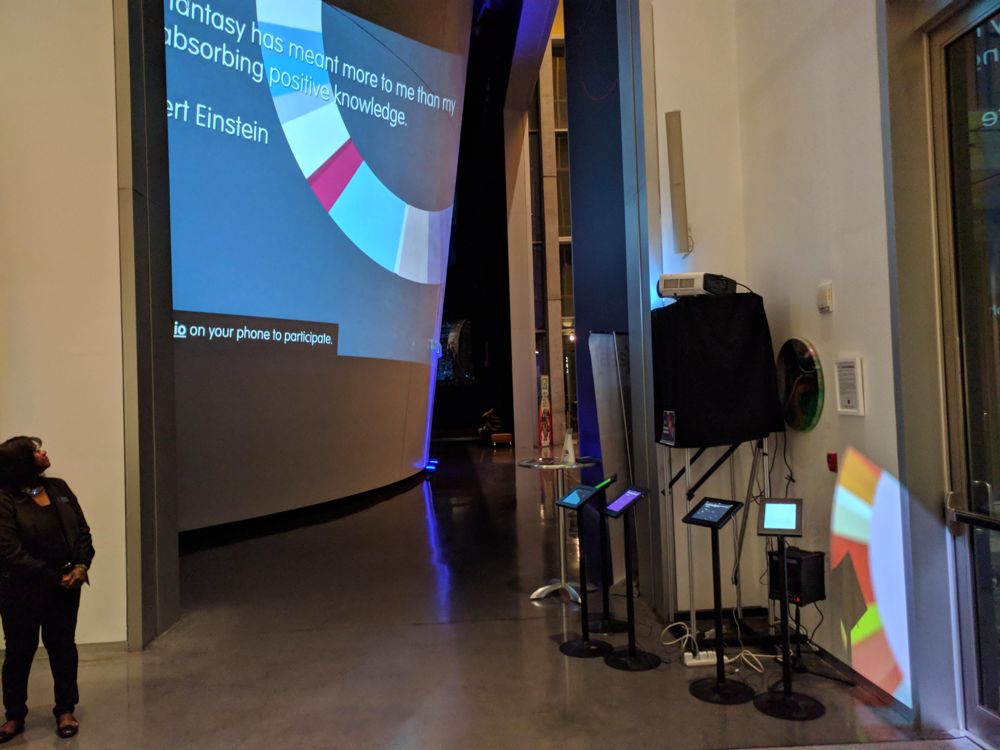
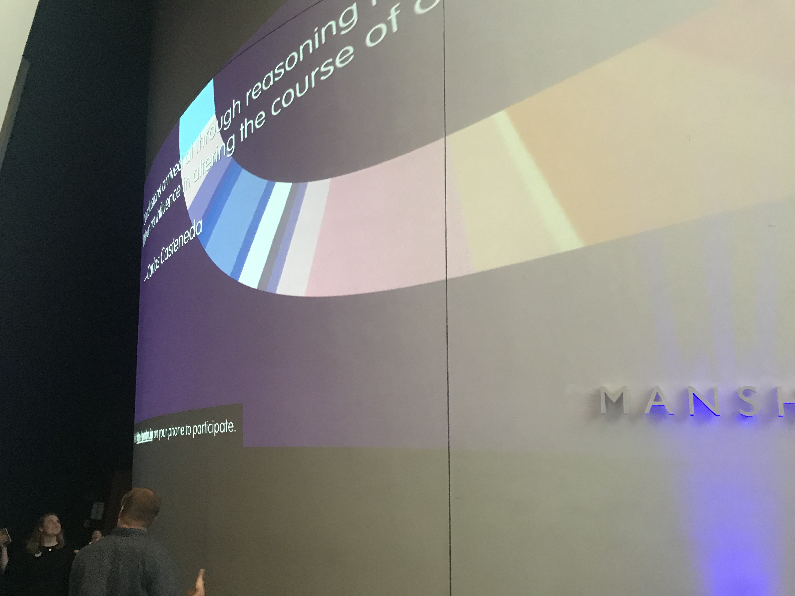
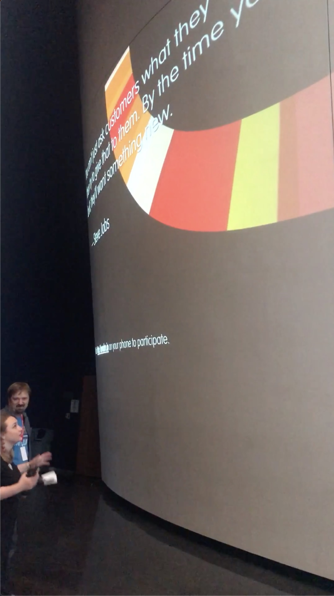
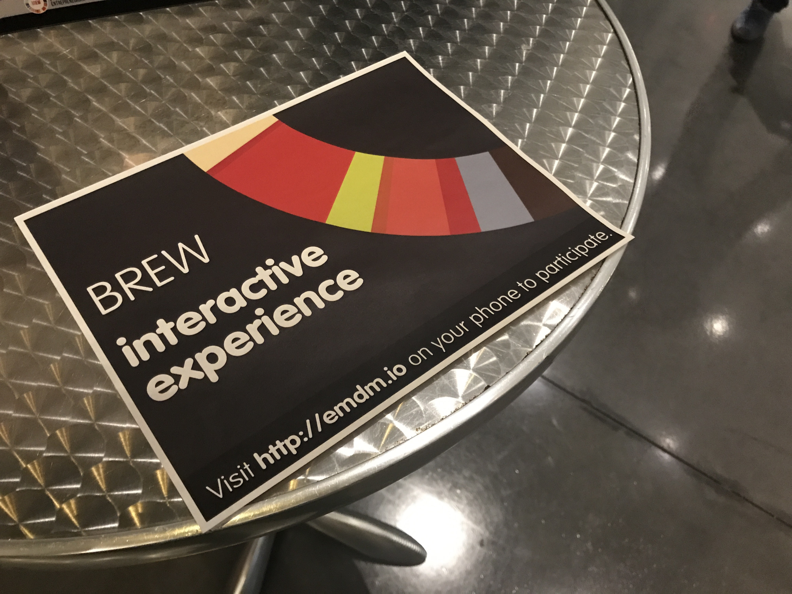
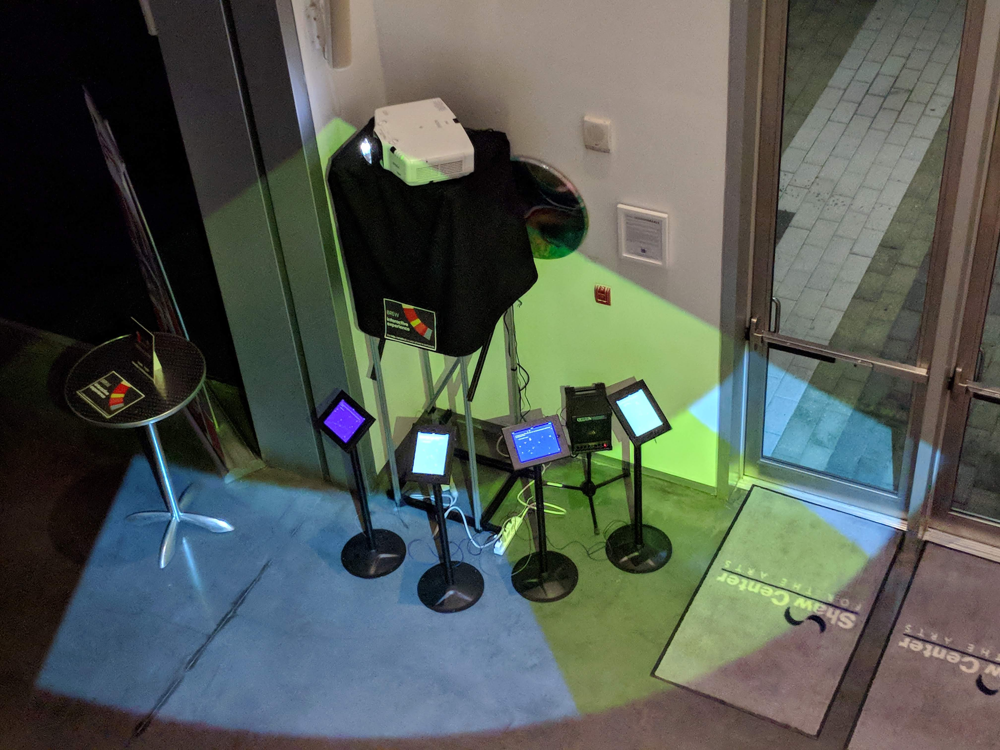
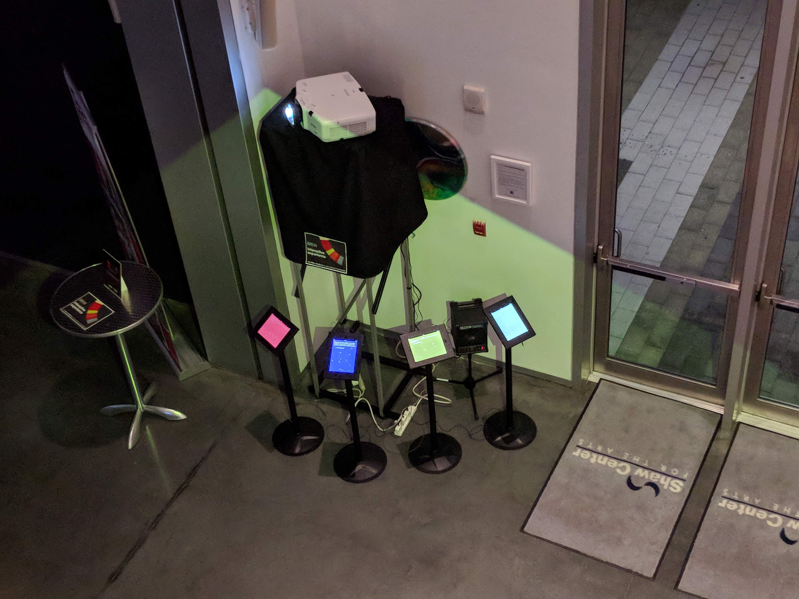
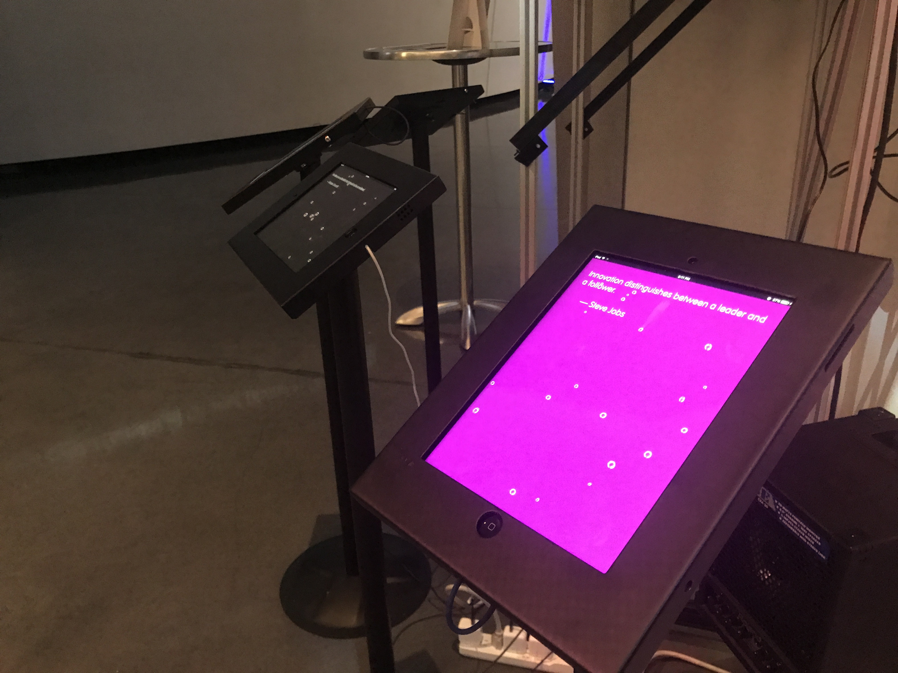
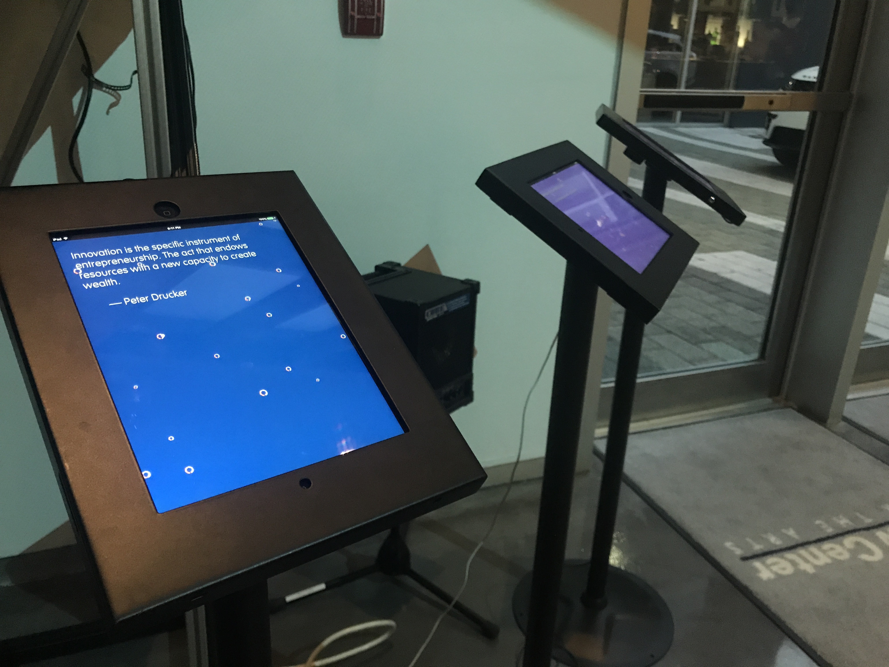

# BREW 2017 Opening Event

_Jesse Allison & Derick Ostrenko_

Baton Rouge Entrepreneurship Week

In 2017 the opening event to BREW incorporated an interactive projection and mobile app system that welcomed entrepreneurs to the week's events. 

> Without change there is no innovation, creativity, or incentive for improvement. Those who initiate change will have a better opportunity to manage the change that is inevitable. – _William Pollard_

> Changes call for innovation, and innovation leads to progress. – _Li Keqiang_

----

> Learning and innovation go hand in hand. The arrogance of success is to think that what you did yesterday will be sufficient for tomorrow. – _William Pollard_

> Every once in a while, a new technology, an old problem, and a big idea turn into an innovation. – _Dean Kamen_

> For good ideas and true innovation, you need human interaction, conflict, argument, debate. – _Margaret Heffernan_

> Innovation distinguishes between a leader and a follower. – _Steve Jobs_

> There is no innovation and creativity without failure. Period. – _Brene Brown_

> You have to have a big vision and take very small steps to get there. You have to be humble as you execute but visionary and gigantic in terms of your aspiration. In the Internet industry, it's not about grand innovation, it's about a lot of little innovations: every day, every week, every month, making something a little bit better. – _Jason Calacanis_

> Once you have an innovation culture, even those who are not scientists or engineers - poets, actors, journalists - they, as communities, embrace the meaning of what it is to be scientifically literate. They embrace the concept of an innovation culture. They vote in ways that promote it. They don't fight science and they don't fight technology. – _Neil deGrasse Tyson_

---

> Without tradition, art is a flock of sheep without a shepherd. Without innovation, it is a corpse. – _Winston Churchill_

> The only way you survive is you continuously transform into something else. It's this idea of continuous transformation that makes you an innovation company. – _Ginni Rometty_

> I believe in tradition and innovation, authenticity and passion. – _Jose Andres_

> The five essential entrepreneurial skills for success: Concentration, Discrimination, Organization, Innovation and Communication. – _Harold S. Geneen_

> Innovation is the specific instrument of entrepreneurship. The act that endows resources with a new capacity to create wealth. – _Peter Drucker_

> I want to put a ding in the universe. – _Steve Jobs_

> Ideas won't keep. Something must be done about them. – _Alfred North Whitehead_

> Intuition will tell the thinking mind where to look next. – _Jonas Salk_

> If you have always done it that way, it is probably wrong. – _Charles Kettering_

---

> If you can dream it, you can do it. – _Walt Disney_

> Security is mostly a superstition. Life is either a daring adventure or nothing. – _Helen Keller_

> You can't solve a problem on the same level that it was created. You have to rise above it to the next level. – _Albert Einstein_

> Do not fear mistakes. There are none. – _Miles Davis_

> The creation of something new is not accomplished by the intellect, but by the play instinct arising from inner necessity. The creative mind plays with the object it loves. – _Carl Jung_

> There is only one thing stronger than all the armies of the world: and that is an idea whose time has come. – _Victor Hugo_

> If you lose the power to laugh, you lose the power to think. – _Clarence Darrow_

> Ideas are like rabbits. You get a couple and learn how to handle them, and pretty soon you have a dozen. – _John Steinbeck_

---

> To accomplish great things we must dream as well as act. – _Anatole France_

> It is the essence of genius to make use of the simplest ideas. – _Charles Peguy_

> There's no good idea that cannot be improved on. – _Michael Eisner_

> We don't see things as they are, we see things as we are. – _Anais Nin_

> We don't know a millionth of one percent about anything. – _Thomas Edison_

> The best vision is insight. – _Malcolm Forbes_

> Genius is infinite painstaking. – _Michelangelo_

> Nothing will change the fact that I cannot produce the least thing without absolute solitude. – _Goethe_

---

> Neither a lofty degree of intelligence, nor imagination, nor both together, go to the making of genius. Love, Love, Love. That is the soul of genius. – _Mozart_

> Swipe from the best, then adapt. – _Tom Peters_

> Give me the young man who has brains enough to make a fool of himself. – _Robert Louis Stevenson_

> You can expect no influence if you are not susceptible to influence. – _Carl Jung_

> Whether or not you can observe a thing depends upon the theory you use. It is the theory which decides what can be observed. – _Albert Einstein_

> Whatever you can do, or dream you can, begin it. Boldness has genius, power and magic in it. – _Goethe_

---

> Sit, walk, or run, but don't wobble. – _Zen proverb_

> The greater the contrast, the greater the potential. Great energy only comes from a correspondingly great tension of opposites. – _Carl Jung_

> We don't know who discovered water, but we're certain it wasn't a fish. – _John Culkin_

> I will act as if what I do will make a difference. – _William James_

> There is no such thing as a long piece of work, except one that you dare not start. – _Charles Baudelaire_

> What is now proved was once only imagined. – _William Blake_

> Remember, a dead fish can float down a stream, but it takes a live one to swim upstream. – _W.C. Fields_

---

> 99 percent of success is built on failure. – _Charles Kettering_

> If the only tool you have is a hammer, you tend to see every problem as a nail. – _Abraham Maslow_

> Not everything that counts can be counted, and not everything that can be counted counts. – _Albert Einstein_

> The test of a first-rate intelligence is the ability to hold two opposed ideas in the mind at the same time, and still retain the ability to function. – _F. Scott Fitzgerald_

> The ultimate creative thinking technique is to think like God. If you're an atheist, pretend how God would do it. – _Frank Lloyd Wright_

> I start where the last man left off. – _Thomas Edison_

> Never confuse motion with action. – _Ernest Hemingway_

> The greatest invention in the world is the mind of a child. – _Thomas Edison_

---

> No matter how well you perform, there's always somebody of intelligent opinion who thinks it's lousy. – _Sir Laurence Olivier_

> You must do the thing you think you cannot do. – _Eleanor Roosevelt_

> I'll play it first and tell you what it is later. – _Miles Davis_

> The way to get good ideas is to get lots of ideas and throw the bad ones away. – _Linus Pauling_

> Discovery is seeing what everybody else has seen, and thinking what nobody else has thought. – _Albert Szent-Gyorgi_

> A pile of rocks ceases to be a rock pile when somebody contemplates it with the idea of a cathedral in mind."– _Antoine Saint-Exupery_

> Without a deadline, baby, I wouldn't do nothing. – _Duke Ellington_

---

> You miss 100 percent of the shots you never take. – _Wayne Gretzky_

> In the beginner's mind there are many possibilities; in the expert's mind there are few. – _Shunryu Suzuki_

> Never tell people how to do things. Tell them what to do and they will surprise you with their ingenuity. – _General George Patton_

> The man with a new idea is a crank – _until the idea succeeds. – _Mark Twain_

> A problem well stated is a problem half solved. – _Charles Kettering_

> The best thinking has been done in solitude. The worst has been done in turmoil. – _Thomas Edison_

> Don't be afraid to take a big step when one is indicated. You can't cross a chasm in two small jumps. – _David Lloyd George_

> The silly question is the first intimation of some totally new development. – _Alfred North Whitehead_

> A man is not idle because he is absorbed in thought. There is a visible labor and there is an invisible labor. – _Victor Hugo_

> Money never starts an idea; it is the idea that starts the money. – _William J. Cameron_

> Systems die; instincts remain. – _Oliver Wendell Holmes_

> You will never find the time for anything. If you want time, you must make it. – _Charles Burton_

---

> Whenever anything is being accomplished, it is being done, I have learned, by a monomaniac with a mission. – _Peter Drucker_

> One of the illusions of life is that the present hour is not the critical, decisive one. – _Ralph Waldo Emerson_

> The lightning spark of thought generated in the solitary mind awakens its likeness in another mind. – _Thomas Carlyle_

> I failed my way to success. – _Thomas Edison_

> Never doubt that a small group of thoughtful, committed citizens can change the world. Indeed, it is the only thing that ever has. – _Margaret Mead_

> The way to succeed is to double your failure rate. – _Thomas Watson, (Founder of IBM)_

> Innovation opportunities do not come with the tempest but with the rustling of the breeze. – _Peter Drucker_

> The enterprise that does not innovate ages and declines. And in a period of rapid change such as the present, the decline will be fast. – _Peter Drucker_

> You can only be as good as you dare to be bad. – _John Barrymore_

> No idea is so outlandish that it should not be considered. – _Winston Churchill_

> Conclusions arrived at through reasoning have very little or no influence in altering the course of our lives. – _Carlos Casteneda_

> After years of telling corporate citizens to 'trust the system,' many companies must relearn instead to trust their people – _and encourage their people to use neglected creative capacities in order to tap the most potent economic stimulus of all: idea power. – _Rosabeth Moss Kanter_

> If the creator has a purpose in equipping us with a neck, he surely would have meant for us to stick it out. – _Arthur Koestler_

> If you do not express your own original ideas, if you do not listen to your own being, you will have betrayed yourself. – _Rollo May_

> Nothing is more dangerous than an idea when it is the only one you have. – _Emile Chartier_

> There's always an element of chance and you must be willing to live with that element. If you insist on certainty, you will paralyze yourself. – _J.P. Getty_

> Almost all really new ideas have a certain aspect of foolishness when they are just produced. – _A.N. Whitehead_

> Our best ideas come from clerks and stockboys. – _Sam Walton_

> The gift of fantasy has meant more to me than my talent for absorbing positive knowledge. – _Albert Einstein_

> Every act of creation is, first of all, an act of destruction. – _Pablo Picasso_

> Time flies like an arrow. Fruit flies like a banana. – _Groucho Marx_

> Imagination is more important than knowledge. – _Albert Einstein_

> Genius, in truth, means little more than the faculty of perceiving in an unhabitual way. – _William James_

> Vision is the art of seeing things invisible. – _Jonathan Swift_

> The best way to predict the future is to create it. – _Alan Kay_

> If you go to your grave without painting your masterpiece, it will not get painted. No one else can paint it. – _Gordon MacKenzie_

> Taking a new step, uttering a new word, is what people fear most. – _Fyodor Dostoevsky_

> There is a vitality, a life force, that is translated to you into action, and because there is only one of you in all time, this expression is unique. And if you block it, it will never exist through any other medium, and will be lost. – _Martha Graham_

> We have approximately 60,000 thoughts in a day. Unfortunately, 95% of them are thoughts we had the day before. – _Deepak Chopra_

> Confusion is a word we have invented for an order that is not yet understood. – _Henry Miller_

> I refuse to be intimidated by reality anymore. What is reality? Nothing but a collective hunch. – _Lily Tomlin_

> Now that we have met with paradox we have some hope of making progress. – _Niels Bohr_

> Microsoft is always two years away from failure. – _Bill Gates_

> We've reached the end of incrementalism. Only those companies that are capable of creating industry revolutions will prosper in the new economy. – _Gary Hamel_

> If I have a thousand ideas and only one turns out to be good, I am satisfied. – _Alfred Noble_

> I've been doing a lot of abstract painting lately, extremely abstract. No brush, no paint, no canvas, I just think about it. – _Steven Wright_

> You can't just ask customers what they want and then try to give that to them. By the time you get it built, they'll want something new. – _Steve Jobs_

> I am looking for a lot of people who have an infinite capacity to not know what can't be done. – _Henry Ford_

> You can have brilliant ideas, but if you can't get them across, your ideas won't get you anywhere. – _Lee Iacocca_

> I can't understand why people are frightened of new ideas. I'm frightened of the old ones. – _John Cage_

---

## Short Videos

[BREW-InnovationWall](/images/BREW-InnovationWall.MOV )

[BREW-Tablets](/images/BREW-Tablets.mov)

